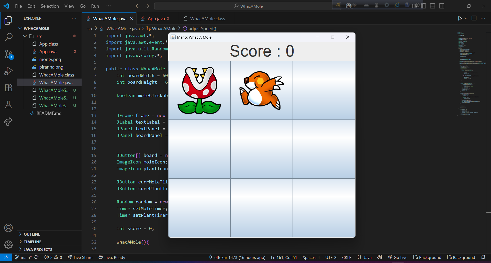

🎯 Whac-A-Mole: Mario Edition 🎯

A fun, interactive **Whac-A-Mole** desktop game built in **Java** using **Swing**!
Tap the mole (Monty) for points—but beware of the piranha plants! One wrong move and it's game over.

I built this game seeing a youtube video to learn how to bbuild a game using java and swing. I modified this game like you can click only one time before the mole(monty) move but there you can click multiple time also i added a function when your score reached 100 your game speed will increase 10ms  when 200 it will increase more 10ms. 

In future i intend to add more future.

🕹️ Features
- 🎯 Click the mole (Monty) to earn points.
- 💀 Avoid clicking the piranha plant or the game ends.
- ⏱️ Dynamic difficulty: The more you score, the faster the mole and plants appear.
- 🎨 Smooth and scaled graphics using `ImageIcon`.

🚀 Getting Started

Prerequisites

- Java JDK 8 or higher
- Any Java IDE (e.g., IntelliJ, Eclipse, NetBeans) or command-line compiler

Assets

Make sure to place the following image files inside your project’s `src` folder

/monty.png // mole image
/piranha.png // plant image
